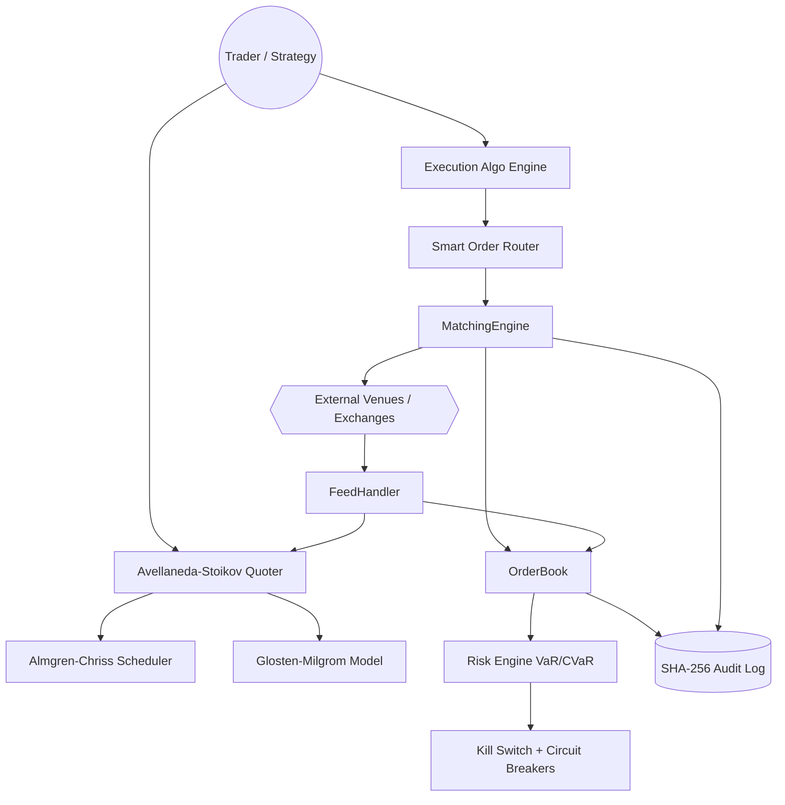
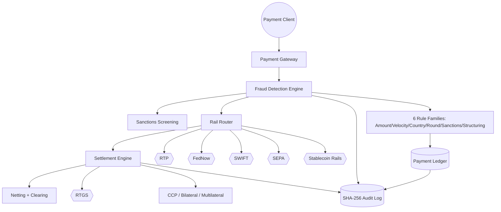
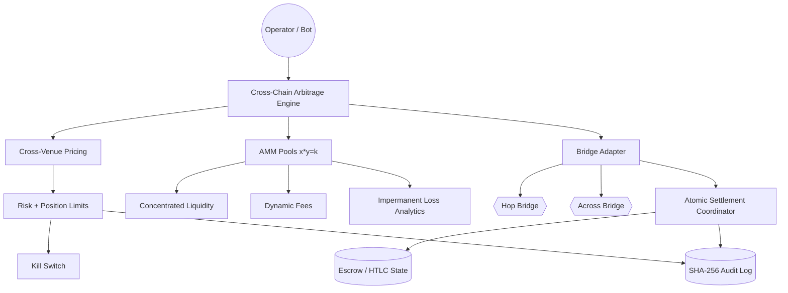

# Apex FinTech Markets

**Institutional-grade market making, high-frequency trading infrastructure, and cross-chain settlement — in one composable stack.**

Apex FinTech Markets is an open, modular trading and payments platform spanning the full capital-markets lifecycle: quantitative market making, low-latency matching and feed infrastructure, automated market makers, execution algorithms, risk and margin engines, regulatory compliance, fraud detection, and multi-rail settlement across traditional payment networks and cross-chain bridges.

> **License:** AGPL-3.0 (see [License](#8-license)). No pricing, subscription, or revenue figures are published — interested parties perform their own due diligence.

---

## Table of Contents

1. [Project Overview](#1-project-overview)
2. [Architecture](#2-architecture)
3. [Features](#3-features)
4. [API Reference](#4-api-reference)
5. [Quick Start](#5-quick-start)
6. [Related Projects](#6-related-projects)
7. [FinTech C2 Matrix](#7-fintech-c2-matrix)
8. [License](#8-license)

---

## 1. Project Overview

Apex FinTech Markets unifies seven capability domains behind a single, coherent trading and settlement plane.

### T0 Market Making
- **Avellaneda–Stoikov** optimal quotes: reservation price and optimal bid/ask spread derived from inventory risk, order-arrival intensity, and volatility (γ, κ, σ, T).
- **Almgren–Chriss** optimal execution: trajectory optimization balancing market-impact cost against timing risk for large parent orders.
- **Glosten–Milgrom** microstructure model: adverse-selection-aware spread setting driven by informed-trader probability and Bayesian belief updates on order flow.

### HFT Infrastructure
- **MatchingEngine** — deterministic price-time priority matching with cancel-replace and IOC/FOK semantics.
- **OrderBook** — cache-efficient limit-order book with O(1) best-bid/ask and depth snapshots.
- **FeedHandler** — normalized market-data ingestion and sequence-gap recovery.

### AMM (Automated Market Maker)
- **x·y=k** constant-product pools.
- **Concentrated liquidity** positions (tick-range capital efficiency).
- **Dynamic fees** that respond to volatility and inventory imbalance.
- **Impermanent loss** analytics and LP P&L attribution.

### Execution Algorithms
- **TWAP** — time-weighted average price slicing.
- **VWAP** — volume-curve tracking.
- **POV** — percentage-of-volume participation.
- **SOR** — smart order routing across venues by price, liquidity, and cost.

### Risk Management
- **VaR** — historical, parametric (variance-covariance), and Monte Carlo.
- **CVaR / Expected Shortfall** — tail-loss measures above the VaR threshold.
- **Stress testing** — deterministic and historical scenario shocks across portfolios.

### Compliance
- **MiFID II** — RTS 6 (algorithmic trading controls), RTS 27 (execution quality data), RTS 28 (best-execution venue disclosure).
- **Basel III** — FRTB market-risk framework and Standardised Approach (SA).
- **EMIR** — derivatives trade reporting and clearing obligations.
- **MAR** — market-abuse surveillance (manipulation, insider dealing).

### Kill Switch
- **Pre-trade risk** checks on every order.
- **Circuit breakers** on price/volume dislocation.
- **Position limits** enforced per instrument, desk, and account.

### Audit Trail
- **SHA-256-chained immutable audit log** — every event cryptographically linked to its predecessor, giving tamper-evident, replayable history.

### Payment Rails
- **RTP** (Real-Time Payments), **FedNow**, **SWIFT**, **SEPA**, and **stablecoin** rails behind a unified payment abstraction.

### Cross-Chain
- **Hop** and **Across** bridge integrations, cross-venue **arbitrage**, and **atomic settlement** primitives.

### Settlement
- **Bilateral**, **multilateral**, and **CCP** clearing models.
- **RTGS** (real-time gross settlement) and **netting** (bilateral/multilateral).

### Fraud Detection
Six rule families evaluated in real time on payment flows:
1. **Amount** — outlier transaction sizing.
2. **Velocity** — burst/frequency anomalies.
3. **Country** — high-risk and mismatched geographies.
4. **Round-amount** — structured round-value indicators.
5. **Sanctions** — watchlist and sanctions screening.
6. **Structuring** — smurfing / sub-threshold pattern detection.

---

## 2. Architecture

### 2.1 Trading Core — Market Making to Matching



### 2.2 Payments, Fraud, and Settlement



### 2.3 Cross-Chain Arbitrage and Atomic Settlement



---

## 3. Features

| Domain | Capability | Description |
|---|---|---|
| Market Making | Avellaneda–Stoikov | Inventory-aware optimal bid/ask quotes |
| Market Making | Almgren–Chriss | Optimal execution trajectory vs. impact |
| Market Making | Glosten–Milgrom | Adverse-selection-aware spread model |
| HFT Infra | MatchingEngine | Deterministic price-time priority matching |
| HFT Infra | OrderBook | O(1) best-bid/ask, depth snapshots |
| HFT Infra | FeedHandler | Normalized feeds + gap recovery |
| AMM | Constant Product | x·y=k liquidity pools |
| AMM | Concentrated Liquidity | Tick-range capital efficiency |
| AMM | Dynamic Fees | Volatility/inventory-responsive fees |
| AMM | Impermanent Loss | LP P&L attribution analytics |
| Execution | TWAP / VWAP / POV | Time, volume, and participation slicing |
| Execution | SOR | Multi-venue smart order routing |
| Risk | VaR | Historical, parametric, Monte Carlo |
| Risk | CVaR / ES | Expected Shortfall tail risk |
| Risk | Stress Testing | Deterministic + historical scenarios |
| Compliance | MiFID II | RTS 6 / 27 / 28 controls & reporting |
| Compliance | Basel III | FRTB and Standardised Approach |
| Compliance | EMIR / MAR | Derivatives reporting & abuse surveillance |
| Safety | Kill Switch | Pre-trade risk, breakers, position limits |
| Audit | Immutable Log | SHA-256-chained tamper-evident trail |
| Payments | Rails | RTP, FedNow, SWIFT, SEPA, stablecoin |
| Cross-Chain | Bridges | Hop, Across integrations |
| Cross-Chain | Atomic Settlement | Cross-chain atomicity + arbitrage |
| Settlement | Clearing | Bilateral, multilateral, CCP, RTGS, netting |
| Fraud | 6 Rules | Amount, velocity, country, round, sanctions, structuring |

---

## 4. API Reference

### 4.1 Market Making — Optimal Quotes

```python
from apex.market_making import AvellanedaStoikov, AlmgrenChriss, GlostenMilgrom

# Avellaneda-Stoikov optimal quotes
as_model = AvellanedaStoikov(gamma=0.1, kappa=1.5, sigma=0.02, horizon=1.0)
quote = as_model.quote(mid_price=100.0, inventory=5, t=0.25)
print(quote.bid, quote.ask, quote.reservation_price)

# Almgren-Chriss execution schedule
ac = AlmgrenChriss(eta=0.01, lambda_risk=1e-6, sigma=0.02)
schedule = ac.optimal_schedule(quantity=10_000, intervals=10)

# Glosten-Milgrom spread
gm = GlostenMilgrom(mu=0.3, prob_informed=0.2)
spread = gm.spread(bid=99.5, ask=100.5)
```

### 4.2 Execution Algorithms

```python
from apex.execution import TWAP, VWAP, POV, SmartOrderRouter

twap = TWAP(quantity=50_000, duration_min=60, slices=60)
twap.execute(symbol="AAPL")

vwap = VWAP(quantity=50_000, volume_curve="historical_curve.json")
vwap.execute(symbol="AAPL")

pov = POV(quantity=50_000, participation=0.10)
pov.execute(symbol="AAPL")

sor = SmartOrderRouter(venues=["nasdaq", "nyse", "iex", "dark_pool"])
routes = sor.route(symbol="AAPL", side="buy", quantity=50_000)
```

### 4.3 HFT Infrastructure — Matching and Book

```python
from apex.hft import MatchingEngine, OrderBook, FeedHandler

book = OrderBook(symbol="AAPL")
book.add_limit(side="bid", price=99.99, size=500)
book.add_limit(side="ask", price=100.01, size=500)
print(book.best_bid(), book.best_ask())

engine = MatchingEngine(book)
fill = engine.submit(side="buy", order_type="IOC", price=100.01, size=200)

feed = FeedHandler(venues=["nasdaq", "nyse"])
feed.subscribe(symbols=["AAPL", "MSFT"])
```

### 4.4 AMM

```python
from apex.amm import ConstantProductPool, ConcentratedLiquidity, DynamicFee

pool = ConstantProductPool(reserve_x=1_000_000, reserve_y=1_000_000)
amount_out = pool.swap(direction="x_to_y", amount_in=10_000)
print("spot price:", pool.spot_price(), "slippage:", pool.slippage(10_000))

cl = ConcentratedLiquidity(pool, tick_lower=-100, tick_upper=100)
cl.add_liquidity(amount=25_000)

fee = DynamicFee(base_bps=5, volatility=0.03, inventory_skew=0.2)
print("effective fee bps:", fee.effective_bps())
```

### 4.5 Risk Management

```python
from apex.risk import VaR, CVaR, StressTest

var = VaR(confidence=0.99, horizon_days=1)
print(var.historical(returns))
print(var.parametric(returns))
print(var.monte_carlo(returns, simulations=100_000))

cvar = CVaR(confidence=0.99)
print("expected shortfall:", cvar.compute(returns))

st = StressTest(scenarios=["2008_crisis", "2020_covid", "rate_shock_300bp"])
st.run(portfolio)
```

### 4.6 Compliance

```python
from apex.compliance import MiFIDII, BaselIII, EMIR, MAR

mifid = MiFIDII()
mifid.rts6_register_algorithm(algo_id="AS-MM-01", owner="desk_equity")
report27 = mifid.rts27_execution_quality(venue="iex", period="Q1")
report28 = mifid.rts28_top_venues(symbol="AAPL")

basel = BaselIII()
print("FRTB capital:", basel.frtb_charge(portfolio))
print("SA capital:", basel.standardised_approach(portfolio))

emir = EMIR()
emir.report_trade(trade)

mar = MAR()
mar.flag_suspicious(activity)
```

### 4.7 Kill Switch

```python
from apex.safety import KillSwitch, CircuitBreaker, PositionLimits

ks = KillSwitch()
ks.enable()
ks.check(order)  # pre-trade risk gate

cb = CircuitBreaker(price_move_pct=5.0, window_sec=60)
cb.arm(symbol="AAPL")

limits = PositionLimits(max_net=100_000, max_per_symbol=25_000)
limits.enforce(order)
```

### 4.8 Audit Trail

```python
from apex.audit import AuditLog

log = AuditLog(hash_chain="sha256")
log.append(event={"type": "order", "id": "o-123", "side": "buy", "qty": 200})
log.append(event={"type": "fill", "id": "o-123", "price": 100.01})

assert log.verify_chain() is True
for entry in log.replay():
    print(entry.prev_hash, "->", entry.hash)
```

### 4.9 Payments and Fraud

```python
from apex.payments import PaymentGateway, RailRouter
from apex.fraud import FraudEngine

gateway = PaymentGateway()
payment = gateway.create(amount=12500, currency="USD", source="acct_1", target="acct_2")

router = RailRouter()
route = router.select(amount=12500, currency="USD", urgency="instant")
print(route.rail)  # RTP | FedNow | SWIFT | SEPA | stablecoin

fraud = FraudEngine(rules=["amount", "velocity", "country", "round_amount",
                           "sanctions", "structuring"])
decision = fraud.evaluate(payment)
print(decision.approved, decision.triggered_rules)
```

### 4.10 Cross-Chain and Settlement

```python
from apex.crosschain import BridgeAdapter, AtomicSettlement, ArbitrageEngine

bridge = BridgeAdapter(providers=["hop", "across"])
quote = bridge.quote(src_chain="ethereum", dst_chain="arbitrum", amount=10_000)

atomic = AtomicSettlement()
atomic.prepare(quote)
atomic.commit()  # or atomic.rollback()

arb = ArbitrageEngine(pools=[pool_a, pool_b])
opportunities = arb.scan()
```

### 4.11 Settlement Engine

```python
from apex.settlement import SettlementEngine, Netting, Clearing

engine = SettlementEngine(mode="rtgs")
engine.settle(trade)

netting = Netting(type="multilateral")
obligations = netting.compute(trades)

clearing = Clearing(model="ccp")
clearing.clear(obligations)
```

---

## 5. Quick Start

### 5.1 Install

```bash
git clone https://github.com/AAH20/apex-fintech-markets.git
cd apex-fintech-markets
python -m venv .venv && source .venv/bin/activate
pip install -e .
```

### 5.2 Run a Market-Making Simulation

```bash
apex mm simulate --model avellaneda-stoikov --symbol AAPL --horizon 1.0
```

### 5.3 Start the HFT Stack

```bash
apex hft start --orderbook AAPL --matching price-time
apex feed subscribe --venues nasdaq,nyse --symbols AAPL,MSFT
```

### 5.4 Execute a Parent Order

```bash
apex exec run --algo vwap --symbol AAPL --qty 50000 --duration 60m
```

### 5.5 Evaluate Risk and Compliance

```bash
apex risk var --method monte-carlo --confidence 0.99 --portfolio portfolio.json
apex risk stress --scenarios 2008_crisis,2020_covid
apex compliance mifid --report rts28 --symbol AAPL
```

### 5.6 Process a Payment with Fraud Screening

```bash
apex pay send --amount 12500 --currency USD --from acct_1 --to acct_2 --rail rtp
apex fraud screen --payment-id pay_123 --rules all
```

### 5.7 Cross-Chain Arbitrage and Settlement

```bash
apex bridge quote --src ethereum --dst arbitrum --amount 10000 --provider hop
apex arb scan --pools pools.json
apex settle run --mode multilateral --netting true
```

### 5.8 Verify the Audit Chain

```bash
apex audit verify --log ./var/audit.log
apex audit replay --log ./var/audit.log --from-seq 0
```

---

## 6. Related Projects

Apex FinTech Markets is part of the `@AAH20` portfolio. Related repositories:

### Core Trading & Swarm Infrastructure
- **Apex_ULL** — [https://github.com/AAH20/Apex_ULL](https://github.com/AAH20/Apex_ULL)
- **ApexGraphSwarm** — [https://github.com/AAH20/ApexGraphSwarm](https://github.com/AAH20/ApexGraphSwarm)
- **hyper-agent-os** — [https://github.com/AAH20/hyper-agent-os](https://github.com/AAH20/hyper-agent-os)
- **swarm-substrate** — [https://github.com/AAH20/swarm-substrate](https://github.com/AAH20/swarm-substrate)

### Arbitrage & DeFi
- **chrono-arbitrage** — [https://github.com/AAH20/chrono-arbitrage](https://github.com/AAH20/chrono-arbitrage)
- **rtb-arbitrage** — [https://github.com/AAH20/rtb-arbitrage](https://github.com/AAH20/rtb-arbitrage)
- **bonding-curve** — [https://github.com/AAH20/bonding-curve](https://github.com/AAH20/bonding-curve)

### Payments, Fraud & Growth
- **real-time-payment-fraud-platform** — [https://github.com/AAH20/real-time-payment-fraud-platform](https://github.com/AAH20/real-time-payment-fraud-platform)
- **merchant-profit-os** — [https://github.com/AAH20/merchant-profit-os](https://github.com/AAH20/merchant-profit-os)
- **portfolio-growth-engine** — [https://github.com/AAH20/portfolio-growth-engine](https://github.com/AAH20/portfolio-growth-engine)
- **growth-decision-engine** — [https://github.com/AAH20/growth-decision-engine](https://github.com/AAH20/growth-decision-engine)
- **churn-inversion** — [https://github.com/AAH20/churn-inversion](https://github.com/AAH20/churn-inversion)

### Risk, Governance & Safety
- **GRC_Claw** — [https://github.com/AAH20/GRC_Claw](https://github.com/AAH20/GRC_Claw)
- **apex_infrastructure_killswitch_kernel** — [https://github.com/AAH20/apex_infrastructure_killswitch_kernel](https://github.com/AAH20/apex_infrastructure_killswitch_kernel)
- **agent-immune-kernel** — [https://github.com/AAH20/agent-immune-kernel](https://github.com/AAH20/agent-immune-kernel)
- **agent-trust-fabric** — [https://github.com/AAH20/agent-trust-fabric](https://github.com/AAH20/agent-trust-fabric)
- **vuln-triage** — [https://github.com/AAH20/vuln-triage](https://github.com/AAH20/vuln-triage)

### Infrastructure, Cloud & Observability
- **Data Center Commander** — [https://github.com/AAH20/data-center-commander](https://github.com/AAH20/data-center-commander)
- **ai-cloud-cost-optimization-platform** — [https://github.com/AAH20/ai-cloud-cost-optimization-platform](https://github.com/AAH20/ai-cloud-cost-optimization-platform)
- **aiops-observability-platform** — [https://github.com/AAH20/aiops-observability-platform](https://github.com/AAH20/aiops-observability-platform)

### Security & Privacy
- **agentproof-ai-security-scanner** — [https://github.com/AAH20/agentproof-ai-security-scanner](https://github.com/AAH20/agentproof-ai-security-scanner)
- **pqc-enclave** — [https://github.com/AAH20/pqc-enclave](https://github.com/AAH20/pqc-enclave)
- **zk-biometrics** — [https://github.com/AAH20/zk-biometrics](https://github.com/AAH20/zk-biometrics)

### Neuromorphic, Physical & Edge AI
- **neuro-manifold** — [https://github.com/AAH20/neuro-manifold](https://github.com/AAH20/neuro-manifold)
- **neuro-spatial** — [https://github.com/AAH20/neuro-spatial](https://github.com/AAH20/neuro-spatial)
- **cyborg-bench** — [https://github.com/AAH20/cyborg-bench](https://github.com/AAH20/cyborg-bench)
- **sky-sentinel** — [https://github.com/AAH20/sky-sentinel](https://github.com/AAH20/sky-sentinel)
- **edge-vision-mesh** — [https://github.com/AAH20/edge-vision-mesh](https://github.com/AAH20/edge-vision-mesh)

---

## 7. FinTech C2 Matrix

The C2 Matrix maps 20 capability layers across the platform and the broader `@AAH20` ecosystem.

| # | Layer | Apex FinTech Markets Coverage | Related Projects |
|---|-------|-------------------------------|------------------|
| 1 | Market Data | FeedHandler, normalized venue feeds, gap recovery | ApexGraphSwarm, aiops-observability-platform |
| 2 | Order Management | MatchingEngine, OrderBook, cancel-replace, IOC/FOK | Apex_ULL |
| 3 | Risk Management | VaR (hist/param/MC), CVaR/ES, stress testing | GRC_Claw, portfolio-growth-engine |
| 4 | Compliance | MiFID II RTS 6/27/28, Basel III FRTB/SA, EMIR, MAR | GRC_Claw, vuln-triage |
| 5 | Network Infrastructure | Low-latency HFT path, feed normalization | data-center-commander, edge-vision-mesh |
| 6 | Payments | RTP, FedNow, SWIFT, SEPA, stablecoin rails | real-time-payment-fraud-platform |
| 7 | Revenue Assurance | Payment reconciliation, settlement netting | merchant-profit-os |
| 8 | Growth Analytics | Portfolio and growth decisioning hooks | growth-decision-engine, portfolio-growth-engine, churn-inversion |
| 9 | Arbitrage | Cross-venue + cross-chain arbitrage engine | chrono-arbitrage, rtb-arbitrage |
| 10 | DeFi | AMM (x·y=k), concentrated liquidity, dynamic fees, IL | bonding-curve |
| 11 | Merchant | Merchant settlement and profit attribution | merchant-profit-os |
| 12 | AI Infrastructure | Strategy/agent orchestration substrate | hyper-agent-os, swarm-substrate |
| 13 | Cloud Infrastructure | Deployment, scaling, cost control | ai-cloud-cost-optimization-platform, data-center-commander |
| 14 | Security | Kill switch, audit chain, vulnerability triage | apex_infrastructure_killswitch_kernel, agentproof-ai-security-scanner, vuln-triage |
| 15 | Observability | Metrics, tracing, audit replay | aiops-observability-platform |
| 16 | Neuromorphic | Neuromorphic compute for signal/feature work | neuro-manifold, neuro-spatial |
| 17 | Post-Quantum | PQC key material for settlement/audit integrity | pqc-enclave |
| 18 | Physical AI | Robotics/autonomy telemetry integration | cyborg-bench, sky-sentinel |
| 19 | Edge AI | Edge inference for latency-sensitive paths | edge-vision-mesh |
| 20 | Identity & Trust | Trust fabric and biometric attestation | agent-trust-fabric, zk-biometrics, agent-immune-kernel |

---

## 8. License

This project is licensed under the **GNU Affero General Public License v3.0 (AGPL-3.0)**.

- Full license text: [LICENSE](./LICENSE)
- Additional attribution and third-party notices: [NOTICE](./NOTICE)

AGPL-3.0 requires that modified versions made available over a network also publish their complete corresponding source under the same license. See the `NOTICE` file for upstream components, bridge/payment-rail integrations, and model attributions referenced by this project.

---

*No pricing tiers, subscription plans, or revenue targets are published in this repository. All figures, if any, are illustrative and do not constitute financial advice. Interested parties should conduct their own independent due diligence.*
